# Actividad semana 7, 8.

> Universidad Minuto de Dios.
>
> Libardo Salamanca Jimenez

## Inicialización de la solución Git

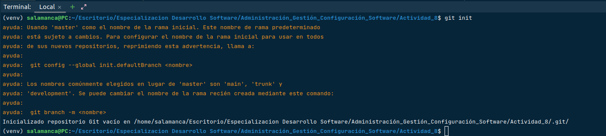

## Crear o renombrar la rama Main

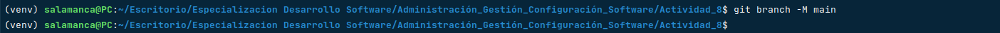

## Agregar Archivo .gitignore

## Agregar los primeros archivos a git

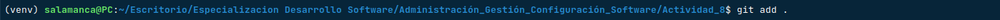

## Validar los documentos pendientes por cargar a GitHub o con una modificación

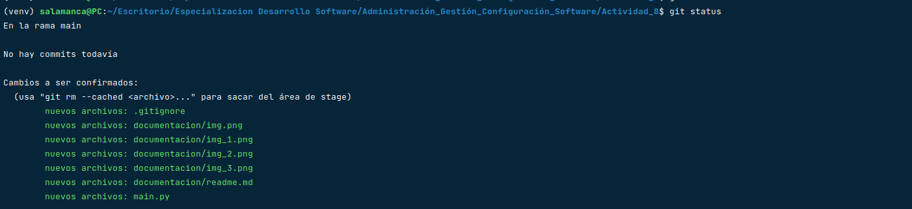

## Integrando la solucion al repositorio de GITHUB

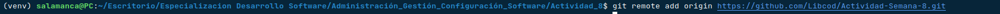

## Primer commit a GitHub

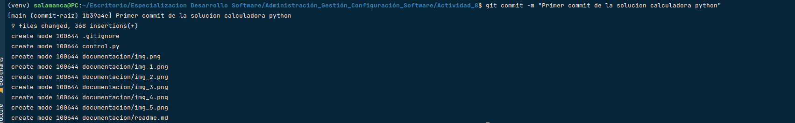

## Verificar primer push

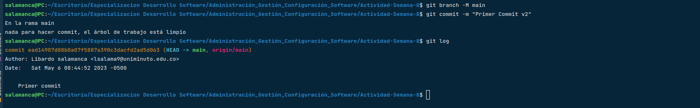

## Creamos una nueva rama y la activamos

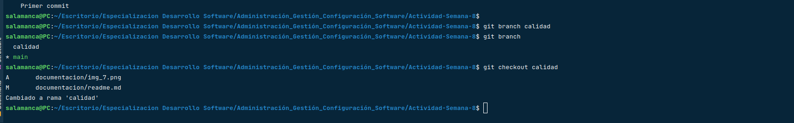

## Creamos el archivo view y realizamos el push en la rama calidad

1. Rama Main

2. Rama Calidad

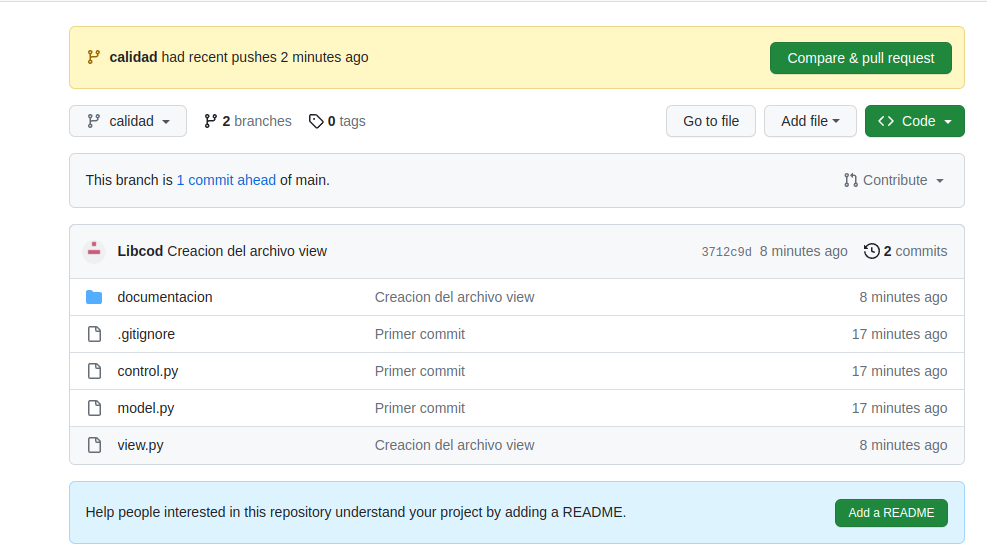

## Unificamos los cambios aplicados en las dos ramas

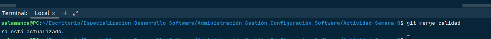

## Realizamos la creación de los archivos MVC, definimos los métodos y las clases correspondiente a cada uno

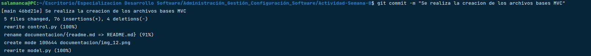

## Se realiza la inclusion del archivo readme enfocado a la documentación de la solución.

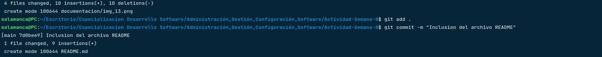

## Se realiza la inclusion del archivo test_model para la generación de pruebas
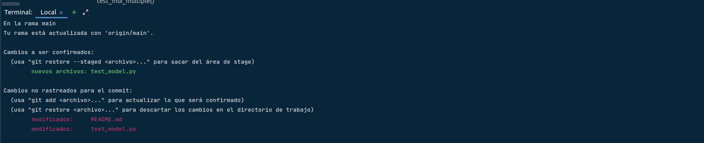

## Se aplica un (git add .) General y el commit con los datos de pruebas.
> Se realizan validaciones de los valores en calculos de suma, resta, multiplicación y division

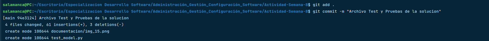

# Aplicación de Pruebas Unitarias (test)

## Se aplica la creación de los escenarios a probar :

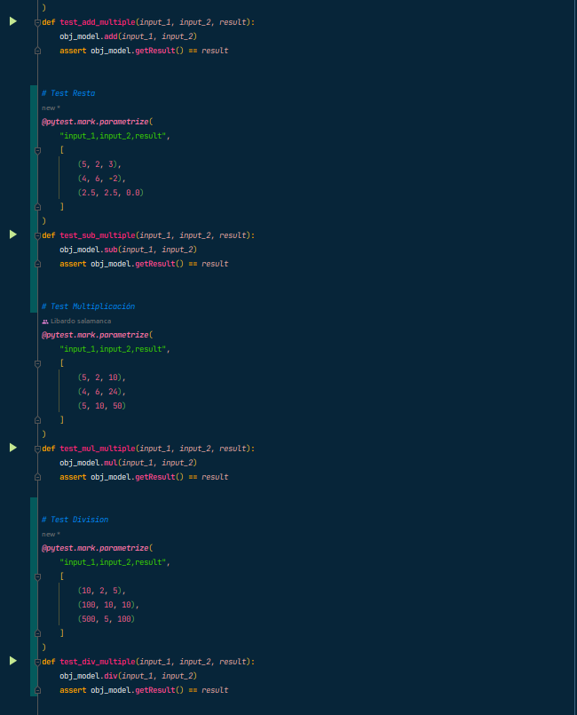

### Resultado de las pruebas:

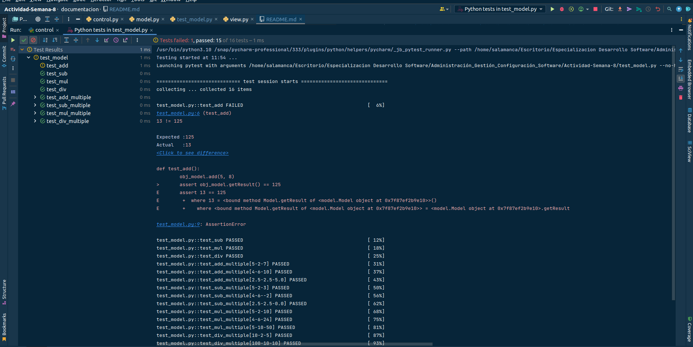

### Result state
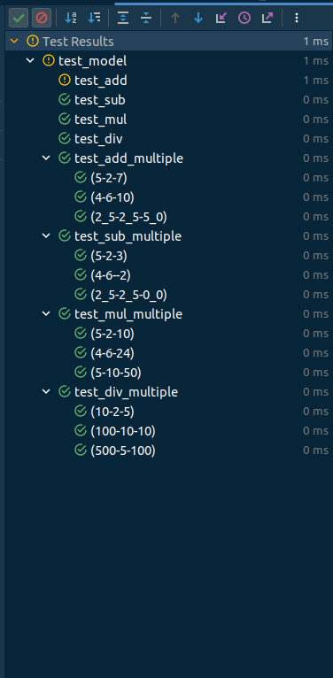

## Se aplica el commit para el registro de resultados 

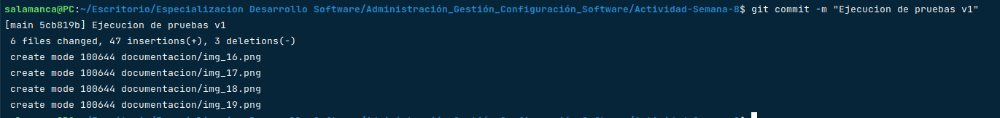

## Se consulta el estado del proyecto identificando los archivos modificados.

## Se aplica el push para el cargue de interfaz grafica.

